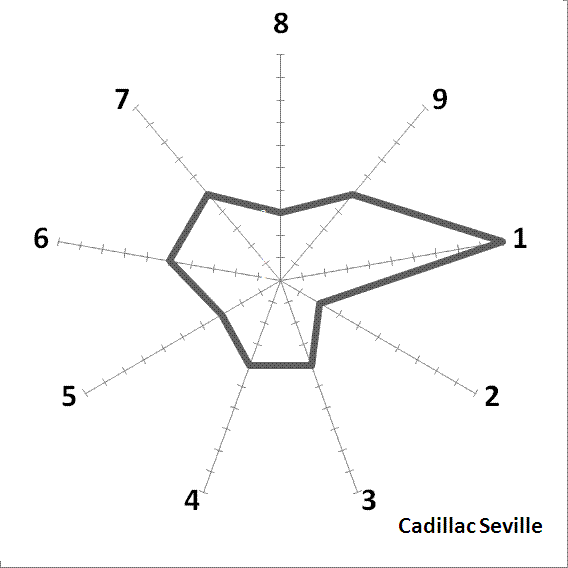
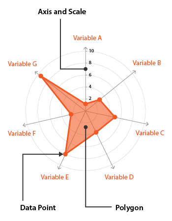
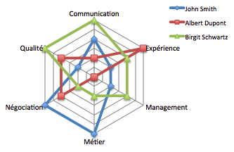
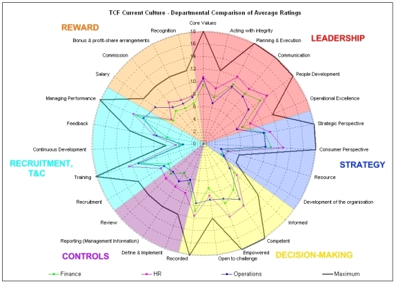
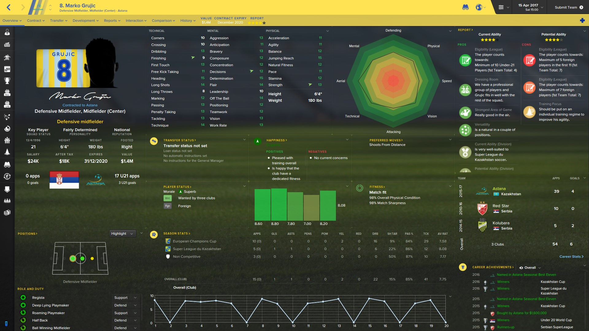
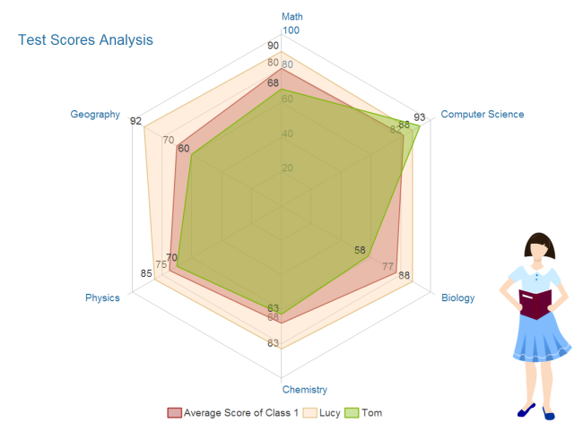
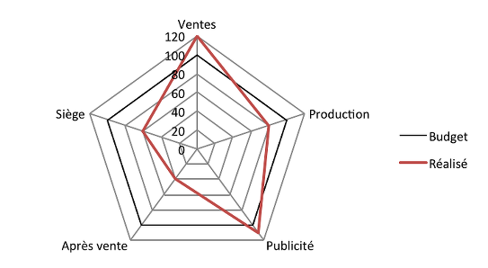

# Interactive Data Visualization - Star plot

## Définition générale

Le *star plot* ou, en français, diagramme en étoile est aussi appelé diagramme de Kiviat, diagramme en radar ou encore diagramme en toile d'araignée. Il s'agit d'une méthode graphique qui permet de repréenter sur un plan en deux dimensions au moins trois ensembles de données multivariées. Ainsi, en partant d'un point central, un axe représente une des données quantifiées.

*Exemple de star plot simple [1]*

## Description

Le *star plot* comporte donc autant d'axes que de données que l'on souhaite repréenter. Ces axes ont la même origine et la même échelle. La longueur d'un axe donne la "puissance" de la donnée dans l'échelle commune dans laquelle elle s'inscrit au sein de ce diagramme. Une fois les données quantifiées par le biais de ces axes, il est commun de relier le "bout", l'extrémité du segment, opposée au centre du diagramme d'où il "part". On obtient ainsi un polygone fermé : cela donne alors une visualisation simple de l'ensemble des valeurs affichées dans le *star plot*, il est dans ce cas possible d'observer les variables ayant un bas niveau et celles ayant un niveau élevé.
De surcroît, il est possible de superposer sur le même diagramme d'autres familles d'observations : par exemple, pour tenir compte de la variations de certaines variables sur un laps de temps.

*Structure d'un star plot [2]*

## Exemples

Le premier star plot a été utilisé par Georg von Mayr dans *Die Gesetzmäßigkeit im Gesellschaftsleben* en 1877.

Comme mentionné dans la partie `Description`, nous pouvons superposer plusieurs observations sur le même diagramme :

*Star plot multiple [3]*

Ce type de diagramme permet, par exemple, dans le cas des ressources humaines de comparer plusieurs personnes suivant leur facultés :

*Exemple de diagramme en étoile dans le cas des ressources humaines [4]*

Ou encore de façon plus complexe pour un seul candidat :

*Exemple de diagramme en étoile dans le cas des ressources humaines pour un candidat [5]*

L'idée d'utiliser ce genre de diagramme pour évaluer les points forts et les points faibles d'un être humain est aussi utilisé dans les jeux vidéos, notamment sportifs comme par exemple le jeu *Football Manager* :

*Exemple de diagramme en étoile dans le jeu vidéo Football Manager [6]*

On peut aussi les utiliser pour comparer les notes de plusieurs élèves dans différentes matières et ainsi pouvoir visualiser facileement les points forts et les points faibles des uns et des autres :

*Exemple de diagramme en étoile pour comparer les notes dans différentes matières [7]*

Ces diagrammes sont aussi très utilisés en marketing :

*Exemple de diagramme en étoile simple dans le marketing [8]*

## Critique

Comme nous pouvons le voir sur les exemples listés ci-dessus, le *star plot* est donc un outil très utile pour visualiser très facilement les points forts et points faibles d'une entités suivant des variables définies, que ce soit pour visualiser la puissance d'un joueur de football dans un jeu vidéo ou les compétences d'un candidat postulant pour un emploi. En superposant cela, il devient ainsi possible de pouvoir comparer différentes entités, par exemple dans le cas de la comparaison des notes obtenues par des élèves dans différentes matières. Ceci étant dit, on voit rapidement une limite à ce genre de diagramme : le nombre d'entités différentes à superposer est limité, il serait illisible de superposer 40 élèves sur la figure 7 par exemple.

De même le nombre de variables ne peut pas être trop grand pour que cela reste lisible, et il doit être d'au moins 3 par simple limite géométrique.
Aussi, bien qu'il soit très intéressant pour visualiser ce que l'on souhaite montrer (utilisation de formes géométriques, naturel pour le cerveau humain), il faut néanmoins qu'il y ait une échelle commune pour que cela fonctionne.

## Sources

### Contenu

1. https://en.wikipedia.org/wiki/Radar_chart
1. http://www.perceptible.fr/blog/toile-araign%25C3%25A9e
1. http://www.ebsi.umontreal.ca/jetrouve/illustre/radar.htm

### Images

1. https://en.wikipedia.org/wiki/Radar_chart
1. https://datavizcatalogue.com/methods/radar_chart.html
1. http://jhodgemapanalysis1.blogspot.fr/2013/04/star-plots.html
1. http://www.perceptible.fr/blog/toile-araign%25C3%25A9e
1. http://www.mclarensolutions.com/wp-content/uploads/2011/01/tcfdepartmentalaverage.jpg
1. https://i.imgur.com/tznKZuO.jpg
1. https://www.edrawsoft.com/templates/images/analysis-radar-chart.png
1. http://www.perceptible.fr/blog/toile-araign%25C3%25A9e
