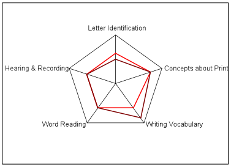

# Interactive Data Visualization - Star plot

## Définition générale

Le *star plot* ou, en français, diagremme en étoile est aussi appelé diagramme de Kiviat, diagramme en radar ou encore diagramme en toile d'araignée. Il s'agit d'une méthode graphique qui permet de repréenter sur un plan en deux dimensions au moins trois ensembles de données multivariées. Ainsi, en partant d'un point central, un axe représente une des données quantifiées.

